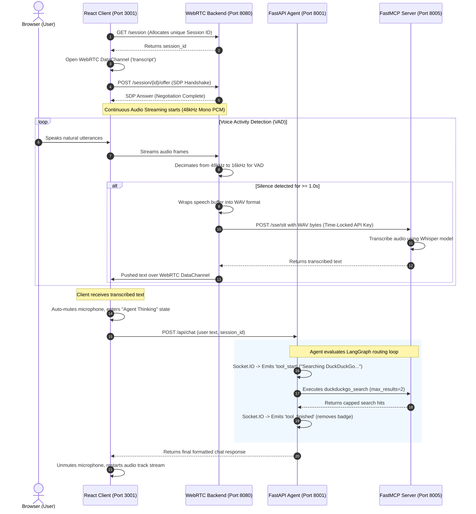

# AI-RTC-Agent 🚀

An advanced, high-performance real-time conversational voice agent workspace. This repository is built as an educational tutorial and open-source blueprint, demonstrating modern techniques in asynchronous audio streaming, voice activity segmentation, decoupled microservices, and secure dynamic local API authentication.

The workspace integrates a responsive React dashboard, an asynchronous WebRTC server, a FastAPI LangGraph agent, and a **FastMCP** server for heavy-duty speech-to-text (STT), secure mail/calendar integration, and real-time web search.

---

## ✨ Key Technical Highlights

- **Four-Tier Decoupled Architecture**: High-speed communication split across a React Client, a WebRTC Audio Processor, a LangGraph FastAPI Agent, and a FastMCP tool runner.
- **Half-Duplex Turn-Based Mic Control**: Prevents echo loops and noise interference. When the agent is thinking or replying, the browser microphone is automatically muted and local recording is paused.
- **Real-Time Socket.IO Badges**: The FastAPI Agent broadcasts live state events (`tool_start`, `tool_finished`) to the client over Socket.IO (Port 8001). The frontend displays immediate execution indicators (e.g. *"Searching DuckDuckGo..."*, *"Creating Calendar Event..."*).
- **Latency Optimization**: Local web search results are capped at a maximum of `2` hits, drastically reducing context bloat and speed-to-response lag.
- **Dynamic Time-Locked Authentication**: Secure, zero-database, timestamp-based authentication between microservices via custom dynamic API key headers.

---

## 🏗️ System Architecture & Data Flow

The workspace maintains constant audio streaming through WebRTC. When the system detects user silence, it segments the audio, transcribes it, runs it through an LLM agent, executes tools via FastMCP, and pushes responses back to the client.

```text
       ┌───────────────────────────┐
       │       React Client        │ ◄────────────────────────┐
       │       (Port 3001)         │                          │
       └─────┬───────────────▲─────┘                          │
             │               │                                │
      WebRTC │               │ WebRTC                         │ Socket.IO
  Audio Mono │               │ DataChannel                    │ Tool Badges
  (48kHz PCM)│               │ (Transcripts)                  │ (tool_start/finished)
             ▼               │                                │
       ┌─────────────┐       │                                │
       │ WebRTC Svr  ├───────┘                                │
       │ (Port 8080) │ ───┐                                   │
       └─────────────┘    │ Transcribed                       │
                          │ Text (FastAPI /api/chat)          │
                          ▼                                   │
                    ┌─────────────┐                           │
                    │ FastAPI Agt ├───────────────────────────┘
                    │ (Port 8001) │ ◄────────────────────────┐
                    └──────┬──────┘                          │
                           │                                 │
                 SSE Call  │                                 │ JSON Tool
             (X-API-Key)   │                                 │ Results
                           ▼                                 │
                    ┌─────────────┐                          │
                    │ FastMCP Svr ├──────────────────────────┘
                    │ (Port 8005) │
                    └─────────────┘
```

### End-to-End Execution Sequence



---

## 📁 Workspace Tour & Components

The repository is organized into four main directories:

```text
AI-RTC-Agent/
├── client/          # Responsive Vite React frontend dashboard
├── server/          # Asynchronous WebRTC audio backend & VAD pipeline
├── agent/           # FastAPI LangGraph conversation & routing service (Port 8001)
└── mcp_app/         # FastMCP server exposing Whisper, Email, Calendar, and Search tools (Port 8005)
```

### 1. Client ([client](file:///home/aloha-zkaria/AI-RTC-Agent/client))
A React web interface that displays connection states, live transcription streams, and the AI conversational timeline.
- **Core Tech**: React 18, Vite 5, native WebRTC `RTCPeerConnection` API, Socket.IO Client.
- **Key Features**: Audio visualizer canvas, dynamic Socket.IO execution status indicators, auto-scrolling timeline, and turn-based microphone state controls.

### 2. Server ([server](file:///home/aloha-zkaria/AI-RTC-Agent/server))
An asynchronous high-throughput network engine built on `aiohttp` and `aiortc` that ingests audio streams.
- **Core Tech**: `aiohttp`, `aiortc`, `webrtcvad`, Python `asyncio`.
- **Key Features**: Inbound audio decimation (48kHz down to 16kHz for VAD evaluation), sliding speech detection window (1.0s silence boundary), and out-of-band transcription pushing over data channels.

### 3. Agent ([agent](file:///home/aloha-zkaria/AI-RTC-Agent/agent))
The conversation brain that manages state routing, prompt generation, and LangGraph flow decisions.
- **Core Tech**: LangGraph, LangChain, FastAPI, python-socketio.
- **Key Features**: Classifies intent (WEB_SEARCH, GMAIL, CALENDAR, GENERAL), runs interactive command loops, coordinates MCP client calls, and broadcasts real-time socket events for tool execution.

### 4. FastMCP Server ([mcp_app](file:///home/aloha-zkaria/AI-RTC-Agent/mcp_app))
A decoupled server providing specialized local tools to the LLM.
- **Core Tech**: FastMCP (Python), PyTorch + OpenAI Whisper, Google Calendar/Gmail OAuth APIs, DuckDuckGo Search API.
- **Key Features**: Warm-boot preloaded Whisper model, Google SMTP and iCalendar generation, rate-limited outbound HTTP calls.

---

## 🔒 Custom Dynamic API Key Authentication

To secure communication between local microservices without relying on bulky databases or exposing static credentials, a **Dynamic Timestamp-based Zero-Shared-State Authentication Protocol** is implemented in [ApiKeyGenerator.py](file:///home/aloha-zkaria/AI-RTC-Agent/server/ApiKeyGenerator.py) and [Middleware.py](file:///home/aloha-zkaria/AI-RTC-Agent/mcp_app/core/Middleware.py).

### How It Works
1. **Time-Locking**: Both the client and server calculate deterministic cryptographic prefixes based on the current Unix epoch timestamp divided by a 5-second interval.
2. **Verification**: When receiving requests, the FastMCP middleware validates that the timestamp matches the expected current or preceding 5-second window, rejecting expired signatures.
3. **Stateless**: The process requires no databases; it only relies on synchronized system clocks.

---

## 🛠️ Step-by-Step Google OAuth Setup (Gmail & Calendar)

To use the outbound email and calendar scheduling features, you must authorize access via a Google Cloud Console project:

### Step 1: Create a Google Cloud Project
1. Open the [Google Cloud Console](https://console.cloud.google.com/).
2. Select **New Project**, name it (e.g. `AI-RTC-Voice-Agent`), and create it.

### Step 2: Enable Google APIs
1. Go to **APIs & Services** > **Library**.
2. Search for **Gmail API** and click **Enable**.
3. Search for **Google Calendar API** and click **Enable**.

### Step 3: Configure the OAuth Consent Screen
1. Go to **APIs & Services** > **OAuth consent screen** and select **External** as the user type.
2. Under **Test Users**, add the exact Gmail address you plan to connect.
   > [!IMPORTANT]
   > You must add your Gmail address as a Test User, or Google's authentication page will block login attempts.

### Step 4: Download Credentials File
1. Go to **APIs & Services** > **Credentials**.
2. Click **+ Create Credentials** > **OAuth client ID**. Set the application type to **Desktop app**.
3. Download the generated client secrets file. Rename it to exactly `credentials.json` and place it in the `mcp_app/` directory:
   ```bash
   mv ~/Downloads/client_secret_xxxx.json mcp_app/credentials.json
   ```

### Step 5: Authorize and Generate token.json
Run the local authentication script to perform the OAuth handshake:
```bash
cd mcp_app
python3 get_token.py
```
A browser window will open. Select your Google account, click through the unverified app warnings, and authorize permissions. A file named `token.json` will be created in your `mcp_app/` directory.

---

## 🚀 Development Quick Start

Please refer to the comprehensive [DEVELOPMENT.md](file:///home/aloha-zkaria/AI-RTC-Agent/DEVELOPMENT.md) for full environmental configuration, installation processes, and testing instructions.

### The Fast Path
To run the full stack at once using our unified workspace script:
```bash
./start.sh
```

---

## 📄 License

This repository is distributed under the **MIT License**. Check out the [LICENSE](file:///home/aloha-zkaria/AI-RTC-Agent/LICENSE) file for more details.
