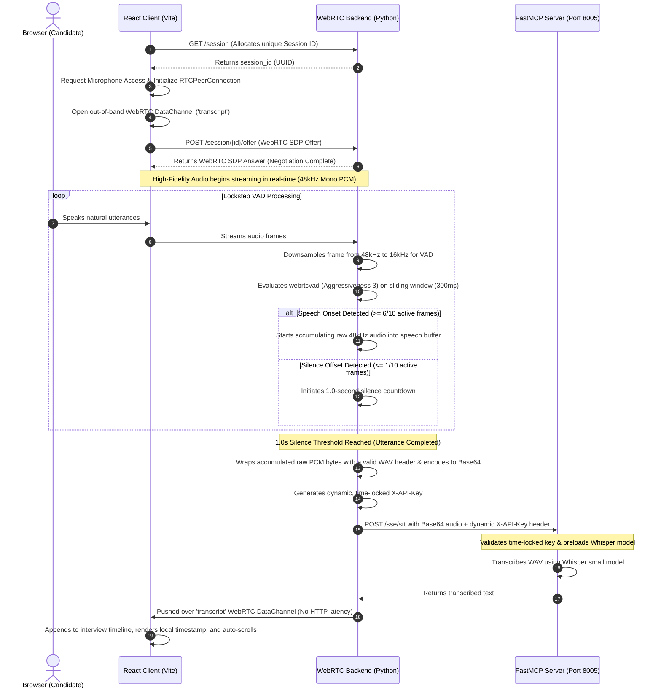

# AI-RTC-Agent 🚀

An advanced, high-performance real-time voice agent workspace designed for zero-latency conversational workflows. This repository is built as an educational tutorial and open-source blueprint for developers, demonstrating modern techniques in asynchronous audio streaming, robust voice activity segmentation, decoupled microservices, and secure dynamic local API authentication.

The workspace integrates a client-side dashboard with an asynchronous WebRTC backend, utilizing **Model Context Protocol (FastMCP)** for heavy-duty speech-to-text (STT), secure mail/calendar integration, and real-time web search capability.

---

## 🏗️ System Architecture

The workflow is built on continuous real-time audio acquisition, lockstep client-to-server WebRTC streaming, and instant, silence-triggered out-of-band transcription delivery.

```text
  ┌─────────────────┐             ┌────────────────┐            ┌───────────────┐
  │  React Client   │             │ Python Server  │            │  FastMCP Core │
  │ (Browser Mic)   │             │ (WebRTC + VAD) │            │ (Whisper/STT) │
  └────────┬────────┘             └───────┬────────┘            └───────┬───────┘
           │      WebRTC Audio Stream     │                             │
           │ ───────────────────────────> │                             │
           │   (48kHz mono PCM frames)    │                             │
           │                              │   Lockstep VAD Segmentation │
           │                              │ ──┐ (16kHz decimation)      │
           │                              │   │                         │
           │                              │ <─┘ (2.0s silence boundary) │
           │                              │                             │
           │                              │   Dynamic API Key Auth      │
           │                              │ ──────────────────────────> │
           │                              │  POST /sse (X-API-Key header)
           │                              │                             │
           │                              │      Whisper STT Tool       │
           │                              │ ──────────────────────────> │
           │                              │   (Decodes WAV to Text)     │
           │                              │                             │
           │                              │     Transcribed Segment     │
           │                              │ <────────────────────────── │
           │    Live Transcript Pushed    │                             │
           │ <─────────────────────────── │                             │
           │    (WebRTC DataChannel)      │                             │
```

### End-to-End Execution Sequence



---

## 📁 Workspace Tour & Components

The codebase is organized into four clean, isolated directories, each managing a specific concern:

```text
AI-RTC-Agent/
├── client/          # Premium React + Vite frontend dashboard
├── server/          # Asynchronous WebRTC audio backend & VAD pipeline
├── mcp/             # FastMCP server exposing Whisper, Email, Calendar, and Search tools
└── agent/           # LLM intent routing and prompt orchestration layer (Adapter mode)
```

### 1. Client (`client/`)
A responsive React dashboard built to simulate a premium HR hiring or interview hub.
* **Core Tech**: React 18, Vite 5, native WebRTC `RTCPeerConnection` API.
* **Key Features**: Auto-scrolling candidate timeline, real-time audio visualizer rings reflecting microphone volume, dynamic connection state monitors, and custom scrollbar styles.
* For deeper design specs, see the [Client README](./client/README.md).

### 2. Server (`server/`)
An asynchronous high-throughput network engine built on `aiohttp` and `aiortc` that handles media consumption.
* **Core Tech**: `aiohttp`, `aiortc`, `webrtcvad`, Python `asyncio`.
* **Key Features**: Asymmetric dual-buffering downsampling (48kHz source decimated to 16kHz VAD in 30ms lockstep), multi-channel audio track slicing, and direct out-of-band text streaming via WebRTC Data Channels.
* For more information on frame-level decimation, see the [Server README](./server/README.md).

### 3. Agent (`agent/`)
An isolated packaging layer designed for LLM prompts, model routing, and conversation adaptors.
* **Core Tech**: Adapters for OpenAI, Google Gemini, and local Ollama interfaces.
* **Key Features**: Prompt loaders and system adapters for structured conversation paths.
* For more details, see the [Agent README](./agent/README.md).

### 4. Model Context Protocol Server (`mcp/`)
A FastMCP application acting as the heavy-duty microservices center of the workspace.
* **Core Tech**: FastMCP (Python implementation), PyTorch + OpenAI Whisper, Google APIs client.
* For comprehensive tool details, see the [MCP README](./mcp/README.md).

---

## ⚡ The MCP Architecture: Deep Dive

To prevent architectural clutter and keep the system decoupled, the `mcp` module separates its concerns into two clean directories: a **Service Layer** and a **Utility Layer**.

```text
mcp/
├── service/          # Shared business logic and long-lived system components (Singletons)
└── utils/            # Distributed helper scripts, error handlers, and rate limiters
```

### The Service Layer (`mcp/service/`)
Business logic is extracted from the FastMCP tool definitions and stored in individual service objects. This promotes high reusability, simplifies testing, and prevents redundant resource consumption:

*   **`LoadModelService.py`**: A thread-safe, module-level singleton that holds the **Whisper `"small"`** model in memory. It provides a `preload_model()` method called at server boot, preventing cold-start response delays on the first audio transmission.
*   **`AudioService.py`**: Intercepts input audio formats. It accepts raw bytes, base64 strings, or base64 bytes, normalizes them into clean WAV binary streams, saves them to temporary files, and passes them to the `LoadModelService` for Whisper transcription.
*   **`MailService.py`**: Encapsulates external mail servers. Handles constructing email formats, applying thread headers (`In-Reply-To`, `References`) for fluid conversational replies, and delivering payloads via SMTP.
*   **`CalendarServices` (`CalnderService.py`, `CalendarGoogleService.py`, `CalendarICSService.py`)**: A dual-provider scheduling engine. It validates date-time strings, interfaces with Google Calendar API, and automatically builds and returns localized **iCalendar (`.ics`)** payloads as a fallback if cloud credentials are absent.

### The Utility Layer (`mcp/utils/`)
Keeps all MCP tools acting predictably by enforcing standard rules and safety margins across the app:

*   **`rate_limiter.py`**: A shared **Token-Bucket Rate Limiter** that throttles outbound API calls per tool (e.g. Gmail: 0.5 requests/sec, DuckDuckGo: 1.0 requests/sec). It supports a "soft wait" (blocking until bucket refills) or "hard fail" (raising `RateLimitError` immediately).
*   **`exceptions.py`**: A localized hierarchy of clean domain exceptions (e.g. `ToolError`, `AuthError`, `RateLimitError`, `ValidationError`).
*   **`response_parser.py`**: Standardizes all tool responses into a clean unified JSON shape. Exposes helpers like `ok(data, message)`, `err(message, code)`, `paginated(items, total)`, and `from_exception(exc)` to automatically convert custom errors into graceful JSON messages.
*   **`auth.py`**: Validates server environment states and securely loads OAuth authorization states.
*   **`http_client.py`**: An asynchronous wrapper featuring custom timeouts, retry strategies, and HTTP status code mappings.

---

## 🔒 Custom Dynamic API Key Authentication

A core design challenge of local AI microservice architecture is securing communication between the WebRTC Python server (backend) and the FastMCP server (tool provider) without exposing static hardcoded credentials in the repository or adding bulky databases.

To solve this, the workspace implements a **Dynamic Timestamp-based Zero-Shared-State Authentication Protocol**.

### The Pattern in Action

Inside `mcp/core/` and `server/` sits `ApiKeyGenerator.py`. The generation and validation sequence operates as follows:

```python
# Both components run this deterministic algorithm:
class api_key_generator:
    def __init__(self, expire_time: int = 5):
        self.expire_time = expire_time # 5-second sliding epoch window
        self.time_zone = "UTC"

    def create_value(self) -> int:
        now_utc = datetime.datetime.now(tz=ZoneInfo("UTC"))
        return int(now_utc.timestamp()) // self.expire_time

    def generate_api_key(self) -> str:
        timestamp = self.create_value()
        suffix = self.generate_suffix(timestamp)
        prefix = self.generate_prefix(timestamp)
        return f"{suffix}_{timestamp}_{prefix}"
```

1.  **Generation**: When the WebRTC server completes an audio segment, it initializes the local `api_key_generator` and builds a dynamic key (e.g., `C_33758364_R`). This key is appended as an `X-API-Key` HTTP header.
2.  **Transportation**: The payload is sent to the FastMCP server at `http://localhost:8005`.
3.  **Middleware Interception**: The FastMCP server routes all traffic through `MCPApiKeyMiddleware` (defined in `mcp/core/Middleware.py`).
4.  **Verification**: The middleware extracts the header, parses the embedded timestamp, and compares it against the server's current dynamic time slot.
    *   **Time-Locking**: If the timestamp in the key deviates from the receiver's window by more than 1 grace interval (5 seconds), the key is rejected as expired.
    *   **Mathematical Determinism**: The middleware generates the expected cryptographic prefixes/suffixes for that specific timestamp using deterministic logarithmic functions (`math.sqrt(math.log10(timestamp))`). If the string matches, it is authenticated.

### Why This is Ideal for Developers
*   **Zero Database**: No database or database credentials are required.
*   **Zero Leakage**: No static long-lived key is stored in source files, preventing credentials leakage.
*   **Zero Session Syncing**: The authentication is stateless and depends only on synchronized system time clocks (UTC).

---

## 🛠️ Step-by-Step Google OAuth & Gmail Setup Tutorial

To use the advanced email inbox and calendar scheduling tools, you must configure a Google Cloud Console project and authorize desktop application access. Follow these instructions exactly:

### Step 1: Create a Google Cloud Project
1.  Go to the [Google Cloud Console](https://console.cloud.google.com/).
2.  Log in using your preferred Gmail account.
3.  Click the Project Dropdown in the top navigation bar and select **New Project**.
4.  Give the project a recognizable name (e.g., `AI-RTC-Agent-Workspace`) and click **Create**.

### Step 2: Enable Google APIs
1.  In the left sidebar, navigate to **APIs & Services** > **Library**.
2.  Search for **Gmail API**, click it, and click **Enable**.
3.  Return to the API Library, search for **Google Calendar API**, and click **Enable**.

### Step 3: Configure the OAuth Consent Screen
Because this is a developer workspace, you will configure a "Desktop Application" consent screen in test mode:
1.  Go to **APIs & Services** > **OAuth consent screen**.
2.  Select **External** for the User Type, and click **Create**.
3.  Provide the mandatory details:
    *   **App name**: `AI RTC Voice Agent`
    *   **User support email**: Your own Gmail address.
    *   **Developer contact information**: Your own Gmail address.
4.  Click **Save and Continue** (skip adding scopes for now, as scopes are requested programmatically by our setup script).
5.  On the **Test Users** panel, click **+ Add Users** and enter the exact Gmail address you intend to use.
    > [!IMPORTANT]
    > If you skip adding your email as a Test User, Google's authorization screen will return a block error during login.
6.  Click **Save and Continue** to finish.

### Step 4: Download Credentials File
1.  Go to **APIs & Services** > **Credentials**.
2.  Click **+ Create Credentials** at the top of the page, and select **OAuth client ID**.
3.  Set the **Application type** to **Desktop app**.
4.  Set the name to `Voice Agent Client`, then click **Create**.
5.  In the confirmation modal, click **Download JSON**.
6.  Rename the downloaded file to exactly **`credentials.json`**.
7.  Move the file into the `mcp/` directory:
    ```bash
    mv ~/Downloads/client_secret_xxxx.json ~/AI-RTC-Agent/mcp/credentials.json
    ```

### Step 5: Authorize and Generate `token.json`
With the client credentials in place, run our local authorization script:
1.  Open your terminal and navigate to the `mcp/` folder:
    ```bash
    cd mcp
    ```
2.  Run the token generator script:
    ```bash
    python get_token.py
    ```
3.  **What happens next**:
    *   A local web browser tab will automatically open, pointing to Google's authentication page.
    *   Log in using the Gmail account you configured as a test user.
    *   Click **Advanced** > **Go to AI RTC Voice Agent (unsafe)** to bypass Google's unverified app warning.
    *   Grant the requested scopes (Gmail Modify and Google Calendar Full Write/Read Access).
    *   Upon successful authorization, the browser will display "The token store has been created."
    *   A new file named **`token.json`** will be generated inside your `mcp/` folder. This token handles the authorized secure access.

---

## ⚙️ Environment Variables Reference

Copy the templates and configure your regional environment keys:

### 1. The MCP Layer Environment (`mcp/.env`)
Create the environment file inside the `mcp/` directory:
```bash
cd mcp && cp .env.example .env
```

| Variable | Default Value | Description |
| :--- | :--- | :--- |
| `MAIL_HOST` | `smtp.gmail.com` | Outbound SMTP server address. |
| `MAIL_PORT` | `587` | Port used for SMTP (587 for STARTTLS, 465 for SSL). |
| `MAIL_USERNAME` | `your-email@gmail.com` | Outbound email sender username. |
| `MAIL_PASSWORD` | `your-app-password` | Gmail App Password (not your primary account password). |
| `MAIL_ENCRYPTION` | `false` | Set to `true` for Port 465 (SSL), `false` for Port 587 (STARTTLS). |
| `GMAIL_TOKEN_FILE` | `token.json` | Relative path to the generated Gmail/Calendar OAuth token. |
| `GMAIL_SENDER` | `your-email@gmail.com` | Matches the Gmail user account associated with the OAuth token. |
| `OLLAMA_BASE_URL` | `http://localhost:11434` | Base URL for local Ollama LLM integration. |
| `GOOGLE_API_KEY` | `""` | Optional Google Gemini developer API key. |
| `OPENAI_API_KEY` | `""` | Optional OpenAI primary API key. |

> [!TIP]
> **Generating a Gmail App Password**:
> If your Gmail account has 2-Step Verification enabled, standard SMTP connections will be blocked. You must generate an App Password:
> 1. Go to your [Google Account Security Settings](https://myaccount.google.com/security).
> 2. Search for **App Passwords** in the search bar.
> 3. Create an app named `AI-RTC-Agent`, copy the generated 16-character code, and paste it into `MAIL_PASSWORD` in your `.env`.

### 2. The Agent Layer Environment (`agent/.env`)
Create the environment file inside the `agent/` directory:
```bash
cd agent && cp .env.example .env
```

Set the appropriate keys based on your orchestrator preference (OpenAI, Gemini, or Ollama).

---

## 🚀 Quick Start Guide

Follow this sequence to run the entire workspace stack locally:

### 📋 System Prerequisites
Make sure your system has the following core engines installed:
*   **Python 3.10+**
*   **Node.js 18+**
*   **ffmpeg**: Whisper requires ffmpeg to process and decode incoming WAV formats.
    *   **macOS**: `brew install ffmpeg`
    *   **Linux**: `sudo apt update && sudo apt install ffmpeg -y`
    *   **Windows**: Download binaries and add them to your system Environment `PATH`.

---

### Step 1: Install Python Core Workspace
From the root directory, install all Python requirements (this installs server, agent, and mcp dependencies):
```bash
pip install -r requirements.txt
```

---

### Step 2: Start the FastMCP Server
Navigate into the `mcp/` directory, prepare your environment, and launch the server:
```bash
cd mcp
cp .env.example .env
# [Ensure credentials.json is placed here and get_token.py has been run]
python main.py
```
*   **Default Port**: `http://localhost:8005`
*   **Warm Boot**: The startup script calls `preload_model()` to load the Whisper model into GPU/CPU memory before incoming connections arrive.

---

### Step 3: Start the WebRTC Signaling Backend
Open a new terminal window, navigate to the `server/` directory, and launch the WebRTC receiver:
```bash
cd server
python main.py
```
*   **Default Port**: `http://localhost:8080`
*   **Ready state**: The server begins listening for SDP handshakes from the browser.

---

### Step 4: Run the React Interface
Open a third terminal, navigate into the `client/` directory, install packages, and boot Vite:
```bash
cd client
npm install
npm run dev
```
*   **Default Port**: `http://localhost:5173`

---

### Step 5: Test the Voice Agent
1.  Open `http://localhost:5173` in your web browser.
2.  Click the glowing **Start Connection** button.
3.  Provide microphone access permissions when prompted by your browser.
4.  Speak naturally into your microphone.
5.  When you stop speaking (exactly **1.0 seconds** of silence), the WebRTC server's state machine will trigger, segmenting the audio, validating authorization via the dynamic time-locked API key, calling the Whisper STT tool, and instantly pushing the transcription back to your dashboard feed.

---

## 🧪 Testing & Code Verification

The repository includes complete test suites for checking audio lockstep VAD and FastMCP execution.

### 1. Test the FastMCP Tools Layer
Verify transcription accuracy, SMTP replies, calendar event parsing, and dynamic rate limiting:
```bash
cd mcp
pytest tests/ -v
```
*Note: The test runner is configured to output clean visual indicators (`[ RUN ]` / `[ OK ]`) for real-time progress monitoring.*

### 2. Test the WebRTC VAD Server
Verify that stereo-to-mono slicing, decimation, and silent frame detection work correctly:
```bash
cd server
pytest tests/ -v
```

---

## 📄 License & Open Source

This repository is distributed under the **MIT License**. Check out the [LICENSE](./LICENSE) details. We welcome issues, PRs, and documentation enhancements to help developers build conversational voice interfaces!
