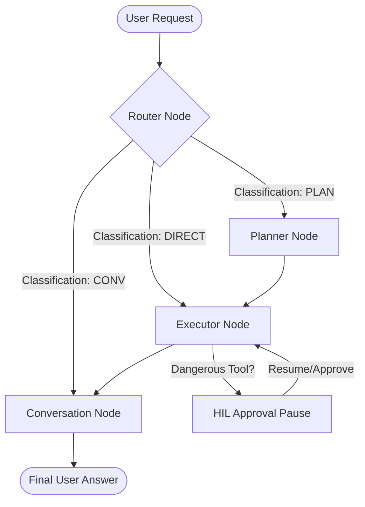

# 🤖 AI Call Agent Engine

The intelligent, event-driven brain of the **AI-RTC-Agent** system. It handles user intent classification, reasoning, multi-step planning, sequential tool execution with Human-in-the-Loop (HIL) safety controls, and real-time WebSocket state streaming.

---

## 🚀 Unified command Center: `runner.sh`

We provide a premium, interactive shell-based entry point `runner.sh` that automates workspace configuration and execution.

To launch the runner, run:
```bash
./runner.sh
```

### What it does:
1. **ASCII Brand Logo**: Displays a custom animated `zkzk` terminal branding banner.
2. **Interactive Configuration**: Guides you using keyboard arrow-keys to select your `AGENT_MODE` (`general`, `hr`, `developer`, `research`) and `AGENT_TYPE` (`api`, `chat`, `test`).
3. **Environment Syncing**: Automatically updates your local `.env` file with the selected parameters.
4. **Instant Execution**:
   * **API Mode**: Prompts you for the port number and the number of Uvicorn workers, then spins up the ASGI server (`uvicorn main:socket_app`).
   * **Chat Mode**: Starts the local terminal CLI chat (`python main.py chat`).
   * **Test Mode**: Scans your `tests/` directory, presents them in an interactive picker menu, and executes the selected integration test.

---

## 🧩 Operational Modes

### 1. API Server (`api`)
Starts the FastAPI and Socket.IO server. All event transitions (intent classification, planning steps, tool start, and tool finished) emit real-time WebSocket events to animate front-end interactions.
* **Launch command**: `uvicorn main:socket_app --host 0.0.0.0 --port 8001 --workers 1`

### 2. Interactive CLI Chat (`chat`)
Starts a terminal-based chat session binding to a dummy user and session.
* **Human-in-the-Loop (HIL)**: When a restricted/dangerous tool is triggered (e.g. `send_email`), the session pauses, displays the arguments, and lets you approve (`y`), reject (`n`), or type feedback to modify parameters before continuing.
* **Launch command**: `python main.py chat`

### 3. Test Runner (`test`)
Interactive testing dashboard to scan, select, and run integration tests (`test_agent_graph.py`, `test_api_server.py`, `test_agent_tools.py`) cleanly as separate subprocesses.

---

## 🏗️ State Graph Architecture

The agent is built using **LangGraph** following a modular State-Machine design:



1. **Router**: Classifies intent into `CONV` (direct conversation), `PLAN` (complex multi-step requests), or `DIRECT` (single tool calls).
2. **Planner**: Drafts a sequential execution plan referencing specific MCP tools.
3. **Executor (act.py)**: Performs a ReAct reasoning loop. Sequentially invokes tools, emits socket statuses, and pauses on dangerous calls (`send_email`, `reply_to_email`, `create_calendar_event`) for HIL confirmation.
4. **Conversation**: Gathers the execution history and synthesizes tool outputs into a clear, final answer.

---

## ⚙️ Configuration (`.env`)

Configure your settings in the `.env` file at the root of the `agent/` directory:

```env
# Operational Mode configuration
AGENT_MODE=general       # options: general, hr, developer, research
AGENT_TYPE=api           # options: api, chat, test

# LLM backend configuration
MODEL_TYPE=ollama        # options: ollama, openai, google
LLM_MODEL=qwen3.5:0.8b   # model identifier
OLLAMA_BASE_URL=http://localhost:11434
```

---

## 📄 HR Mode: CV Memory & the `content/` Folder

When `AGENT_MODE=hr`, the agent gains a CV-aware workflow: candidates can upload a
résumé (or drop one into a shared folder) and the agent answers questions grounded
in that CV.

### The global `content/` folder
A single `content/` directory at the **project root** is the source of truth for all
reference documents. Uploaded CVs are saved here, and the agent looks here when a
user only *mentions* a CV by name in the CLI/chat. The folder is kept in git
(`.gitkeep`) while its contents are ignored.

### Reading CVs (`readcv` tool — PDF, Word & Markdown only)
The `readcv` tool (registered only in `hr` mode) reads documents directly from
`content/`. Supported types are **PDF (`pypdf`)**, **Word (`.docx`, `python-docx`)**,
and **Markdown/text** — anything else is rejected. Resolution is flexible:

| `file_path` argument | Behaviour |
| --- | --- |
| `""` (empty) | Reads the most recently uploaded document |
| `"cv.pdf"` | Exact match inside `content/` |
| `"cv"` | Fuzzy match on the file stem (e.g. → `my_cv.pdf`) |
| absolute path | Used as-is |

### CV memory (`langchain_classic.memory`)
On upload the CV text is sent to the LLM, which extracts **exact keywords** plus
structured knowledge (name, title, skills, experience, education). This profile is
persisted per user in the `cv_memory` SQLite table and injected as a system message
on every turn, so the agent can always answer from the candidate's CV.

The running chat history is trimmed to the **last 3 messages** using
`ConversationBufferWindowMemory(k=3)`, keeping the prompt small while CV knowledge
stays available via the injected memory.

### Upload endpoint
```http
POST /api/cv/upload      (multipart/form-data)
  user_id : string
  file    : PDF | .docx | .md
→ { user_id, file_name, summary, keywords[], knowledge{} }
```
The React client exposes this via the **📎 CV** button next to the chat composer; the
file is saved to `content/`, parsed, stored as CV memory, and the agent immediately
reviews it.

> **Dependencies**: this feature adds `pypdf`, `python-docx`, and `python-multipart`
> (see `requirements.txt`).